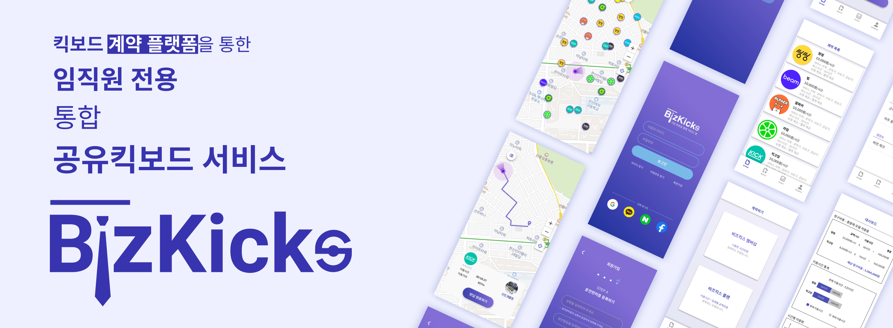
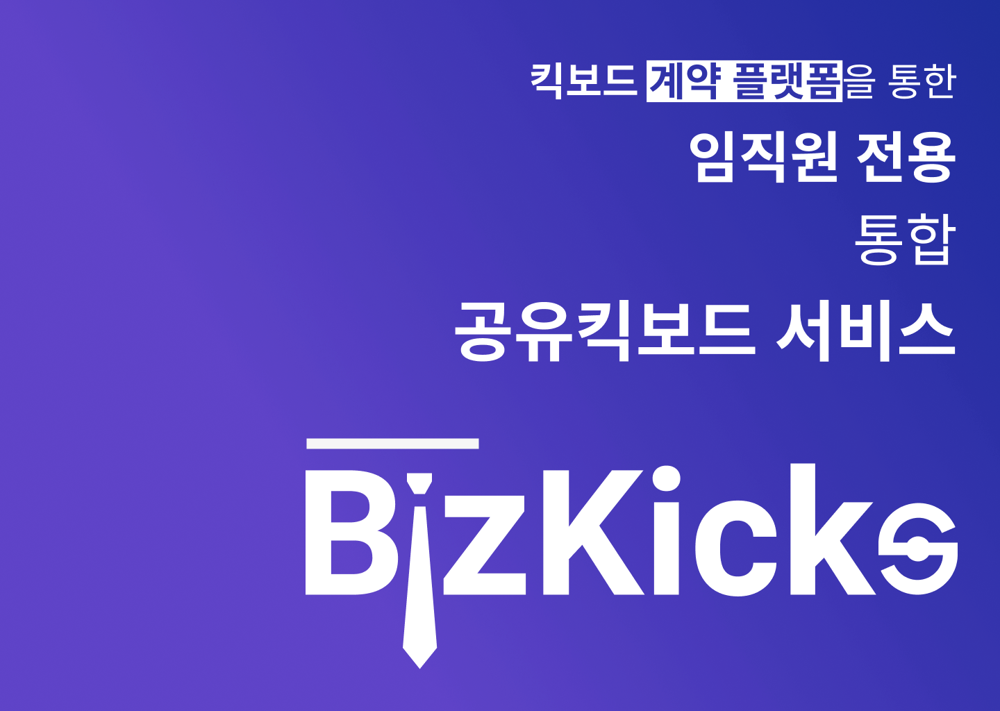
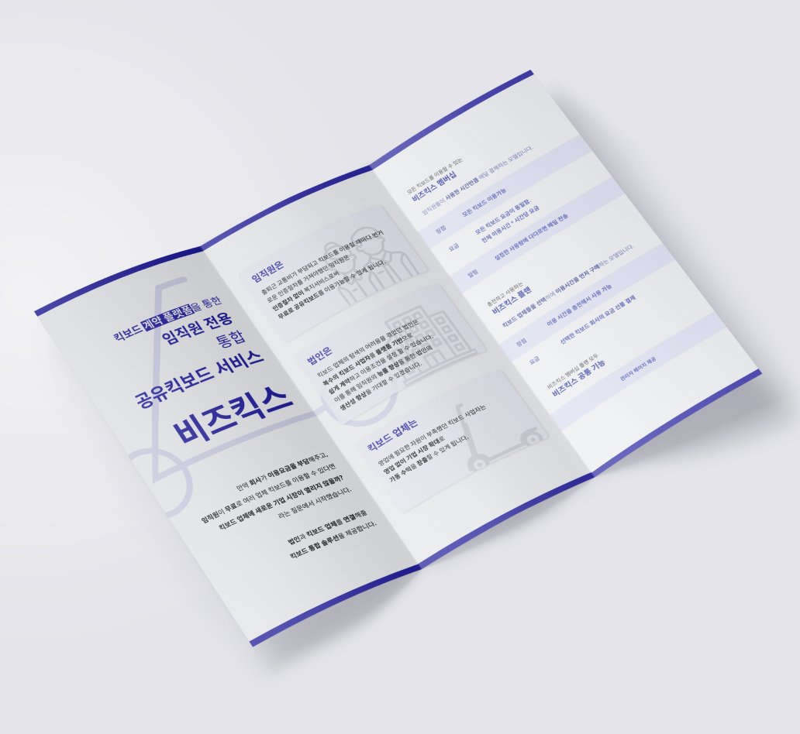
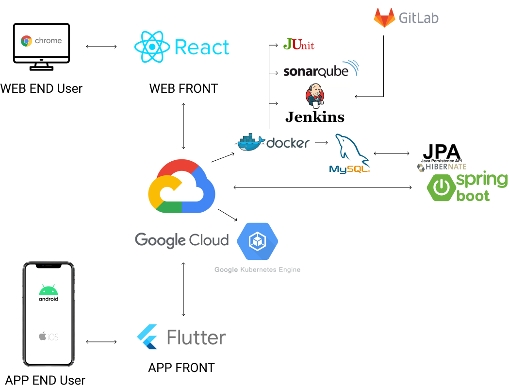
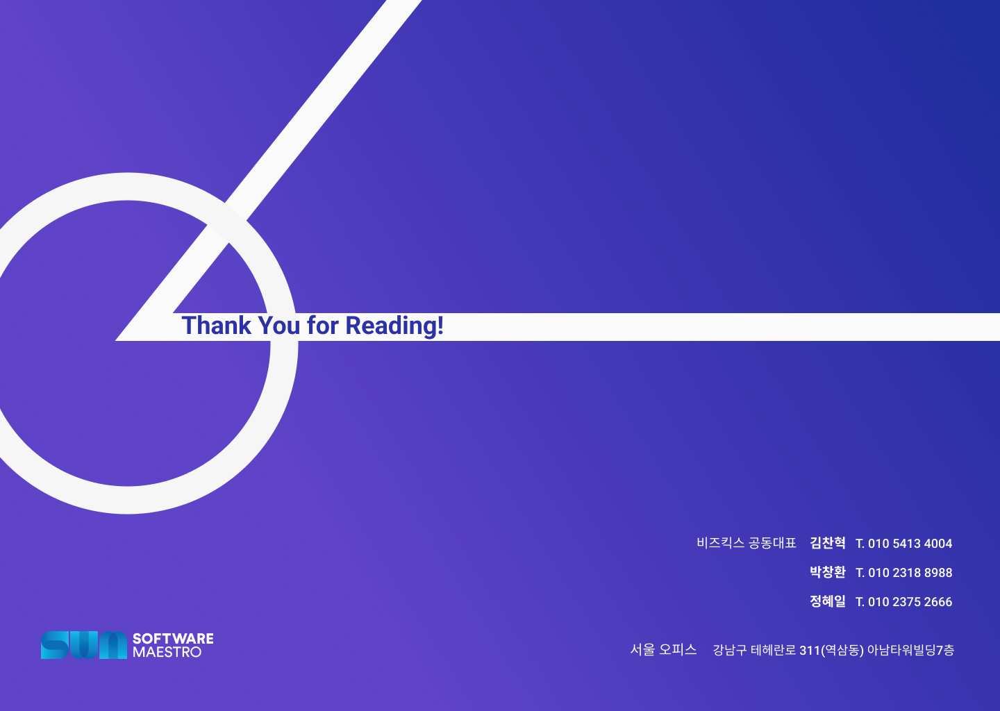

# 비즈킥스 - 임직원 전용 통합 공유킥보드 중개 플랫폼

<p align="center">
	
</p>

<p align="center">
<a href="https://github.com/hyelie/SWM-Bizkicks-Backend/wiki">개발 위키</a> 
| 
<a href="">발표 자료</a> 
| 
<a href="">시연 영상</a>
</p>

<br>

# 개요 (Overview)
현재 퍼스널 모빌리티 산업은 성장하고 있습니다. 공유 킥보드의 월별 이용건수는 꾸준히 증가하고 있고 퍼스널 모빌리티 이용자 중 약 30% 가 출퇴근 목적으로 이용합니다.

퍼스널모빌리티 시장은 개인 결제 중심이며 개인별 사용 **시간량에 따른 과금 모델**을 적용하고 있습니다. 이로인해 출퇴근시 퍼스널 모빌리티를 자주 이용하는 경우 사용자에게 **교통비가 부담**으로 다가옵니다. 한편, 퍼스널 모빌리티 사업자는 **법인 시장 진출에 필요한 자원이 부족**합니다. 퍼스널 모빌리티 업체 규모상 법인 상대로 탐색 및 영업에 필요한 인력과 돈, 시간이 부족합니다.

이러한 문제점을 해결하기 위해 비즈킥스는 기업-킥보드 사업자 간 **퍼스널 모빌리티 이용권 거래 중개 플랫폼** 프로젝트를 진행하였습니다.

**비즈킥스**를 이용한다면
- 킥보드 사업자는 별도의 영업 활동없이 거래시스템에서 계약하여 **법인 시장으로 확대** 후 **킥보드 가동수익**을 높일 수 있게 됩니다.
- 기업은 복수의 퍼스널 모빌리티 사업자를 플랫폼에서 **쉽게 탐색**, 이용조건 설정 후 계약 가능합니다
- 기업 임직원은 기업이 계약한 모든 **퍼스널 모빌리티를 복지 서비스**로써 이용가능합니다.

<br>

# 브랜딩 (Branding)


<table>
<tr>
    <td></td>
    <td> </td>
</tr>
</table>

<br>

# 기술 스택 (Tech Stacks)


### Backend
- Spring Boot - 자바 플랫폼을 위한 오픈 소스 애플리케이션 프레임워크
- JPA - 자바 ORM 기술 표준
- MySQL - 관계형 데이터베이스 관리 시스템

### Design & Collaboration 
- Figma - 온라인 UI 디자인 협업 툴
- Notion - 온라인 문서화 협업 툴

### DevOps
- Gitlab - 웹 기반의 데브옵스 플랫폼
- SonarQube - 자동 리뷰를 수행하기 위한 지속적인 코드 품질 검사용 오픈 소스 플랫폼
- Jenkins - 지속적 통합 서비스를 제공하는 툴
- Docker - 응용 프로그램들을 컨테이너로 실행하고 관리하는 오픈 소스 프로젝트
- Kubernetes - 쿠버네티스는 컨테이너화된 애플리케이션의 자동 배포, 스케일링 등을 제공하는 관리시스템
- Google Cloud Platform - 구글의 클라우드 컴퓨팅 서비스

<br>

# 시작하기 (Getting Started)
## 전제 조건 (Prerequisite)
- java 8+
- gradle 7.1.1+
- springboot 2.5.3+
- docker 20.10.7+
- docker Compose v2.0.0-beta.6+

## 환경 구성 (Environment Setup)
### Clone
```
# clone project
git clone https://github.com/hyelie/SWM-Bizkicks-Backend.git
cd backend
```

### 로컬 환경구성
```
# install redis, mysql
cd dbenv
docker-compose up -d
```

### 프로젝트 실행
```
# build and execution on local
gradlew build -x test
gradlew bootRun --args='--spring.profiles.active=local'
```

## 디렉토리 정보 (Directory Information)
```
Bizkicks
 - backend
    - src
       - main
          - java\com\bizkicks\backend
             - api : controller가 들어있는 폴더
             - dto : DTO class가 들어있는 폴더
             - entity : Entity class가 들어있는 폴더
             - repository : Repository class가 들어있는 폴더
             - service : Service class가 들어있는 폴더
           - resource : config 파일과 resource 파일이 들어있는 폴더
       - test\java\com\bizkicks\backend : 테스트 코드들이 있는 폴더
 - dbend : 개발환경 설정을 위한 docker-compose.yml 파일 구성 폴더
```

## 배포 (Deployment)

MySQL, Spring Boot, Redis 배포에 대한 yml 파일입니다.

[Kubernetes 배포 파일](https://github.com/hyelie/SWM-Bizkicks-Kubernetes)

<br>

# 킥스 팀 소개 (Kicks Team Information)
|이름|역할|Github|Contact|
|:---|----|----|----|
|팀장 김찬혁|기획, 프론트엔드 개발|<a href="https://github.com/Chanhook"></a>|<a href="hyelie@postech.ac.kr"></a>|
|박창환|백엔드 개발|<a href="https://github.com/korea3611"></a>|<a href="hyelie@postech.ac.kr"></a>|
|정혜일|백엔드 개발 & DevOps 관리|<a href="https://github.com/hyelie"></a>|<a href="hyelie@postech.ac.kr"></a>|



<br>

이 프로젝트는 [소프트웨어 마에스트로](https://www.swmaestro.org/)에서 진행되었습니다.


