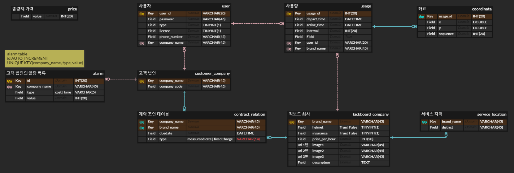

# 비즈킥스
## 법인 타겟 공유킥보드 중개 플랫폼 비즈니스

## 목차
<p>

[0. 팀 소개](#0-팀-소개)
</p>
<p>

[1. 개요](#1-개요)
</p>
<p>

[2. 데이터베이스 스키마](#2-데이터베이스-스키마)
</p>
<p>

[3. 구성도](#3-구성도)
</p>
<p>

[4. 백엔드 API 명세서](#4-백엔드-api-명세서)
</p>
<p>

[5. 동작 구현](#5-동작-구현)
</p>
<p>

[6. 실행 화면](#6-실행-화면)
</p>
<p>

[7. 바람](#7-바람)
</p>


# 0. 👋팀 소개


- #### 팀 이름 : 킥스
- #### 팀장 : 김찬혁
- #### 팀원 : 박창환, 정혜일
- #### 역할 :

| 프론트 | 백엔드 |  
|---|---|  
| - 김찬혁 | - 정혜일 </br> - 박창환|

</br></br>

# 1. 📝개요
현재 퍼스널 모빌리티 산업은 성장하고 있습니다. 공유 킥보드의 월별 이용건수는 꾸준히 증가하고 있고 퍼스널 모빌리티 이용자 중 약 30% 가 출퇴근 목적으로 이용합니다.

현재 퍼스널모빌리티 시장은 개인 결제 중심이며 개인별 사용 시간량에 따른 과금 모델을 적용하고 있습니다. 이로인해 출퇴근시 퍼스널 모빌리티를 자주 이용하는 경우 교통비가 부담됩니다.
또 퍼스널 모빌리티 사업자는 법인 시장 진출에 필요한 자원이 부족합니다. 퍼스널 모빌리티 업체 규모상 법인 상대로 탐색 및 영업에 필요한 인력과 돈, 시간이 부족합니다.

이러한 문제점을 해결하기 위해 비즈킥스는 기업-킥보드 사업자 간 퍼스널 모빌리티 이용권 거래 중개 플랫폼 프로젝트를 진행하였습니다.

비즈킥스를 이용한다면
- 킥보드 사업자는 별도의 영업 활동없이 거래시스템에서 계약하여 법인 시장으로 확대 후 킥보드 가동수익을 높일 수 있게 됩니다.
- 기업은 복수의 퍼스널 모빌리티 사업자를 플랫폼에서 쉽게 탐색, 이용조건 설정 후 계약 가능합니다
-  기업 임직원은 기업이 계약한 모든 퍼스널 모빌리티를 복지 서비스로써 이용가능합니다.


# 1.5. 프로젝트 정보
##  프로젝트 환경
- java 8
- gradle 7.1.1
- springboot 2.5.3
- docker 20.10.7
- docker Compose v2.0.0-beta.6
- jenkins lts
- sonarQube lts
- mysql 5.6

## 실행방법
로컬 환경구성
```
cd dbenv
docker-compose up -d
```

local 에서 빌드 및 실행 시
```
gradlew build -x test
gradlew bootRun --args='--spring.profiles.active=local'
```

## 브랜치 정보
master
develop
alarmapi2
contractapi
...

- **디렉토리 정보**
```
Bizkicks
 - backend
    - src
       - main
          - java\com\bizkicks\backend
             - api : controller가 들어있는 폴더
             - dto : DTO class가 들어있는 폴더
             - entity : Entity class가 들어있는 폴더
             - repository : Repository class가 들어있는 폴더
             - service : Service class가 들어있는 폴더
           - resource : config 파링과 resource 파일이 들어있는 폴더
       - test\java\com\bizkicks\backend : 테스트 코드들이 있는 폴더
 - dbend : 개발환경 설정을 위한 docker-compose.yml 파일 구성 폴더
```

# 2. 📋데이터베이스 스키마




# 4. 백엔드 API 명세서

# API 목록

## 계약관리

### 1) 종량제 가격

`/manage/measuredrate-price`

Method : **GET**

Description : 클라이언트가 요청하면 서버에서 헤더에 있는 아이디가 관리자 아이디인지 유효성 검사를 진행한 후 저장되어 있는 종량제 가격을 리턴.

Request : 사용자의 정보가 담긴 Authorization header를 전송함.

Response : 성공 시 종량제 가격 리턴. 실패 시 실패 사유를 메시지로 리턴.

Response example)

```json
HTTP/1.1 200 OK
{
   "price" : 15000 (number)
}

HTTP/1.1 401 Unauthorized
{
   "timestamp": "2021-08-09T21:48:32.9523621" (datetime),
   "status": 401 (number),
   "error": "UNAUTHORIZED" (string),
   "code": "USER_STATUS_LOGOUT" (string),
   "msg": "사용자가 로그아웃 상태입니다." (string)
}

HTTP/1.1 403 Forbidden
{
   "timestamp": "2021-08-09T21:50:40.2363793" (datetime),
   "status": 403 (number),
   "error": "FORBIDDEN" (string),
   "code": "NOT_ALLOWED" (string),
   "msg": "허가되지 않은 접근입니다." (string)
}
```

Returns:

- 200 OK
- 401 Unauthorized (user status logout)
- 403 Forbidden (not allowed)

Note:

- 헤더에 명시된 사용자가 "관리자"여야만 요청할 수 있음.

### 2) 전체 계약목록에서 킥보드 업체 목록 및 요약정보

`/manage/products`

Method : **GET**

Description : 클라이언트가 요청하면 서버에서 헤더에 있는 아이디가 관리자 아이디인지 유효성 검사를 진행한 후 전체 킥보드 업체 목록 및 요약 정보를 리턴.

Request : 사용자의 정보가 담긴 Authorization header를 전송함.

Response : 성공 시 전체 킥보드 업체 목록 및 요약정보 리턴. 실패 시 실패 사유를 메시지로 리턴.

Response example)

```json
HTTP/1.1 200 OK
{
   "list" : [
      {
         "company_name" : "씽씽" (string),
         "price_per_hour" : 10000 (number),
         "service_location" : t (string list),
         "insurance" : true (boolean),
         "helmet" : false (boolean)
      },
      {
         "company_name" : "킥고잉" (string),
         "price_per_hour" : 12000 (number),
         "service_location" : ["금천구", "강북구", "강서구"] (string list),
         "insurance" : false (boolean),
         "helmet" : true (boolean)
      },
      ...
   ] (json list)
}

HTTP/1.1 401 Unauthorized
{
   "timestamp": "2021-08-09T21:48:32.9523621" (datetime),
   "status": 401 (number),
   "error": "UNAUTHORIZED" (string),
   "code": "USER_STATUS_LOGOUT" (string),
   "msg": "사용자가 로그아웃 상태입니다." (string)
}

HTTP/1.1 403 Forbidden
{
   "timestamp": "2021-08-09T21:50:40.2363793" (datetime),
   "status": 403 (number),
   "error": "FORBIDDEN" (string),
   "code": "NOT_ALLOWED" (string),
   "msg": "허가되지 않은 접근입니다." (string)
}
```

Returns:

- 200 OK
- 401 Unauthorized (user status logout)
- 403 Forbidden (not allowed)

Note:

- 헤더에 명시된 사용자가 "관리자"여야만 요청할 수 있음.

### 3) 킥보드 업체 상세정보 (계약목록과 정액제 모델) 명세를 바꿔야할듯

`/manage/products/{company-name}`

Method : **GET**

Description : 클라이언트가 킥보드 업체 명을 전송하면 서버에서 헤더에 있는 아이디가 관리자 아이디인지 유효성 검사를 진행한 후 킥보드 업체 명에 해당하는 상세 정보를 리턴.

Request : 사용자의 정보가 담긴 Authorization header, path variable로 킥보드 업체 명을 전송함.

Request example)

```json
/manage/products/씽씽
```

Response : 성공 시 path variable에 해당하는 킥보드 업체의 상세 정보 html 리턴. 실패 시 실패 사유를 메시지로 리턴.

Response example)

```json
HTTP/1.1 200 OK
{
   "html" : "/src/씽씽.html" (html file)
}

HTTP/1.1 401 Unauthorized
{
   "timestamp": "2021-08-09T21:48:32.9523621" (datetime),
   "status": 401 (number),
   "error": "UNAUTHORIZED" (string),
   "code": "USER_STATUS_LOGOUT" (string),
   "msg": "사용자가 로그아웃 상태입니다." (string)
}

HTTP/1.1 403 Forbidden
{
   "timestamp": "2021-08-09T21:50:40.2363793" (datetime),
   "status": 403 (number),
   "error": "FORBIDDEN" (string),
   "code": "NOT_ALLOWED" (string),
   "msg": "허가되지 않은 접근입니다." (string)
}

HTTP/1.1 404 Not Found
{
   "timestamp": "2021-08-09T21:53:01.1151735" (datetime),
   "status": 404 (number),
   "error": "NOT_FOUND" (string),
   "code": "KICKBOARD_BRAND_NOT_EXIST" (string),
   "msg": "존재하지 않는 킥보드 브랜드입니다." (string)
}
```

Returns:

- 200 OK
- 401 Unauthorized (user status logout)
- 403 Forbidden (not allowed)
- 404 Not Found (not exist kickboard brand)

Note:

- 헤더에 명시된 사용자가 "관리자"여야만 요청할 수 있음.

### 4) 계약 조회 - 현재 계약 종류, 종료 기간, 계약 중인 킥보드 업체 목록 및 요약정보

`/manage/contracts`

Method : **GET**

Description : 클라이언트가 해당 API를 호출하면 서버에서 헤더에 있는 아이디가 관리자 아이디인지 유효성 검사를 진행한 후 해당 고객 법인의 계약 종류, 종료 기간, 계약중인 킥보드 업체 및 요약정보를 리턴

Request : 사용자의 정보가 담긴 Authorization header를 전송함.

Response : 성공 시 고객 법인의 계약 종류, 종료 기간, 계약중인 킥보드 업체 목록 및 요약정보 리턴. 실패 시 실패 사유를 메시지로 리턴.

Response example)

```json
HTTP/1.1 200 OK
{
  "type" : "measuredRate" (string) | "fixedCharge" (string),
  "duedate" : "2020-12-31" (date)
  "list" : [
      {
         "company_name" : "씽씽" (string),
         "price_per_hour" : 10000 (number),
         "service_location" : ["관악구", "서초구", "강남구"] (string list),
         "insurance" : true (boolean),
         "helmet" : false (boolean)
      },
      {
         "company_name" : "킥고잉" (string),
         "price_per_hour" : 12000 (number),
         "service_location" : ["금천구", "강북구", "강서구"] (string list),
         "insurance" : false (boolean),
         "helmet" : true (boolean)
      },
      ...
  ] (json list)
}

HTTP/1.1 401 Unauthorized
{
   "timestamp": "2021-08-09T21:48:32.9523621" (datetime),
   "status": 401 (number),
   "error": "UNAUTHORIZED" (string),
   "code": "USER_STATUS_LOGOUT" (string),
   "msg": "사용자가 로그아웃 상태입니다." (string)
}

HTTP/1.1 403 Forbidden
{
   "timestamp": "2021-08-09T21:50:40.2363793" (datetime),
   "status": 403 (number),
   "error": "FORBIDDEN" (string),
   "code": "NOT_ALLOWED" (string),
   "msg": "허가되지 않은 접근입니다." (string)
}
```

Validation:

- type : 계약 타입. "measuredRate" 또는 "fixedCharge" 2개 값 중 하나임.
- duedate : YYYY-MM-DD (date)
- list : 계약된 킥보드 회사 목록. type이 measuredRate인 경우 list는 null, fixedCharge인 경우에는각 element는 회사명, 시간당 금액, 서비스 지역, 보험 제공 여부, 헬멧 제공 여부를 가지고 있음.

Returns:

- 200 OK (Success)
- 401 Unauthorized (user status logout)
- 403 Forbidden (Not allowed)

Note:

- 헤더에 명시된 사용자가 "관리자"여야만 요청할 수 있음.

### 5) 계약 추가

`/manage/contracts`

Method : **POST**

Description : 클라이언트가 계약 종류, 계약할 킥보드 회사 목록, 계약 기간을 전송하면 서버에서 헤더에 있는 아이디가 관리자 아이디인지 유효성 검사를 진행한 후 해당 고객 법인의 계약 정보를 남김.

Request : 사용자의 정보가 담긴 Authorization header, 계약 종류, 킥보드 업체 이름 목록, 계약 기간을 POST로 전송함.

Request example)

```json
http body
{
  "type" : "measuredRate" (string) | "fixedCharge" (string),
  "company_list" : ["씽씽", "킥고잉", ... ] (string list),
  "duedate" : "2020-12-31" (datetime)
}
```

Response : 통신 결과 및 메시지 리턴.

Response example)

```json
HTTP/1.1 201 Created
{
   "msg" : "Success" (string)
}

HTTP/1.1 401 Unauthorized
{
   "timestamp": "2021-08-09T21:48:32.9523621" (datetime),
   "status": 401 (number),
   "error": "UNAUTHORIZED" (string),
   "code": "USER_STATUS_LOGOUT" (string),
   "msg": "사용자가 로그아웃 상태입니다." (string)
}

HTTP/1.1 403 Forbidden
{
   "timestamp": "2021-08-09T21:50:40.2363793" (datetime),
   "status": 403 (number),
   "error": "FORBIDDEN" (string),
   "code": "NOT_ALLOWED" (string),
   "msg": "허가되지 않은 접근입니다." (string)
}
```

Validation:

- type : 계약 타입. "measuredRate" 또는 "fixedCharge" 2개 값 중 하나임.
- date : YYYY-MM-DD
- commany_list : 계약할 킥보드 회사 목록. type이 measuredRate인 경우 list는 null, fixedCharge인 경우에는 각 회사명 list임.

Returns:

- 200 OK (Success)
- 401 Unauthorized (user status logout)
- 403 Forbidden (Not allowed)

Note:

- 헤더에 명시된 사용자가 "관리자"여야만 요청할 수 있음.

### 6) 계약 갱신

`/manage/contracts`

Method : **PUT**

Description : 클라이언트가 계약 종류, 계약할 킥보드 회사 목록, 계약 기간을 전송하면 서버에서 헤더에 있는 아이디가 관리자 아이디인지 유효성 검사를 진행한 후 해당 고객 법인의 계약 정보를 갱신함.

Request : 사용자의 정보가 담긴 Authorization header, 계약 종류, 킥보드 업체 이름 목록, 계약 기간을 PUT로 전송함.

Request example)

```json
http body
{
  "type" : "measuredRate" (string) | "fixedCharge" (string),
  "company_list" : ["씽씽", "킥고잉", ... ] (string list),
  "duedate" : "2020-12-31" (date)
}
```

Response : 통신 결과 및 메시지 리턴.

Response example)

```json
HTTP/1.1 200 OK
{
   "msg" : "Success" (string)
}

HTTP/1.1 401 Unauthorized
{
   "timestamp": "2021-08-09T21:48:32.9523621" (datetime),
   "status": 401 (number),
   "error": "UNAUTHORIZED" (string),
   "code": "USER_STATUS_LOGOUT" (string),
   "msg": "사용자가 로그아웃 상태입니다." (string)
}

HTTP/1.1 403 Forbidden
{
   "timestamp": "2021-08-09T21:50:40.2363793" (datetime),
   "status": 403 (number),
   "error": "FORBIDDEN" (string),
   "code": "NOT_ALLOWED" (string),
   "msg": "허가되지 않은 접근입니다." (string)
}
```

Validation:

- type : 계약 타입. "measuredRate" 또는 "fixedCharge" 2개 값 중 하나임.
- date : YYYY-MM-DD (date)
- commany_list : 계약할 킥보드 회사 목록. type이 measuredRate인 경우 list는 null, fixedCharge인 경우에는 각 회사명 list임.

Returns:

- 200 OK (Success)
- 401 Unauthorized (user status logout)
- 403 Forbidden (Not allowed)

Note:

- 헤더에 명시된 사용자가 "관리자"여야만 요청할 수 있음.
- 고객 법인의 계약된 킥보드 법인 중 일부 킥보드 법인을 삭제/추가하는 경우 해당 API를 이용.

### 7) 계약 삭제

`/manage/contracts`

Method : **DELETE**

Description : 클라이언트가 해당 API를 호출하면 서버에서 관리자 아이디인지 유효성 검사를 진행한 후 해당 고객 법인의 계약 정보를 삭제함.

Request : 사용자의 정보가 담긴 Authorization header을 전송함.

Response : 통신 결과 및 메시지 리턴.

Response example)

```json
HTTP/1.1 204 No Content

HTTP/1.1 401 Unauthorized
{
   "timestamp": "2021-08-09T21:48:32.9523621" (datetime),
   "status": 401 (number),
   "error": "UNAUTHORIZED" (string),
   "code": "USER_STATUS_LOGOUT" (string),
   "msg": "사용자가 로그아웃 상태입니다." (string)
}

HTTP/1.1 403 Forbidden
{
   "timestamp": "2021-08-09T21:50:40.2363793" (datetime),
   "status": 403 (number),
   "error": "FORBIDDEN" (string),
   "code": "NOT_ALLOWED" (string),
   "msg": "허가되지 않은 접근입니다." (string)
}
```

Returns:

- 204 No Content (Success)
- 401 Unauthorized (user status logout)
- 403 Forbidden (Not allowed)

Note:

- 헤더에 명시된 사용자가 "관리자"여야만 요청할 수 있음.

### 8) 알림 확인

`/manage/alarms`

Method : **GET**

Description : 클라이언트가 해당 API를 호출하면 서버에서 관리자 아이디인지 유효성 검사를 진행한 후 해당 고객 법인이 등록해 둔 알림 목록을 리턴함.

Request : 사용자의 정보가 담긴 Authorization header을 전송함.

Response : 성공 시 알림 목록 리턴, 실패 시 메시지 리턴.

Response example)

```json
HTTP/1.1 200 OK
{
  "list" : [
      {
         "type" : "cost" (string) | "time" (string),
        "value" : 2500 (number)
      },
      {
         "type" : "cost" (string) | "time" (string),
        "value" : 2500 (number)
      },
      ...
  ] (json list)
}

HTTP/1.1 401 Unauthorized
{
   "timestamp": "2021-08-09T21:48:32.9523621" (datetime),
   "status": 401 (number),
   "error": "UNAUTHORIZED" (string),
   "code": "USER_STATUS_LOGOUT" (string),
   "msg": "사용자가 로그아웃 상태입니다." (string)
}

HTTP/1.1 403 Forbidden
{
   "timestamp": "2021-08-09T21:50:40.2363793" (datetime),
   "status": 403 (number),
   "error": "FORBIDDEN" (string),
   "code": "NOT_ALLOWED" (string),
   "msg": "허가되지 않은 접근입니다." (string)
}

HTTP/1.1 404 Not Found
{
   "timestamp": "2021-08-09T21:53:01.1151735" (datetime),
   "status": 404 (number),
   "error": "NOT_FOUND" (string),
   "code": "COMPANY_NOT_EXIST" (string),
   "msg": "존재하지 않는 법인입니다." (string)
}
```

Validation:

- type : 알림 종류. "cost" 또는 "time" 2개 값 중 하나임.

Returns:

- 200 OK (Success)
- 401 Unauthorized (user status logout)
- 403 Forbidden (Not allowed)
- 404 Not Found (company not exist)

Note:

- 헤더에 명시된 사용자가 "관리자"여야만 요청할 수 있음.

### 9) 알림 수정

`/manage/alarms`

Method : **POST**

Description : 클라이언트가 알림 종류, 알림 조건 목록을 전송하면 서버에서 관리자 아이디인지 유효성 검사를 진행한 후 해당 고객 법인이 등록해 둔 알림 목록을 갱신함.

Request : 사용자의 정보가 담긴 Authorization header, 알림 종류&알림 조건의 목록을 전송함.

Requset example)

```json
http body
{
   "list" : [
      {
         "type" : "cost" (string) | "time" (string),
        "value" : 2500 (number)
      },
      {
         "type" : "cost" (string) | "time" (string),
        "value" : 2500 (number)
      },
      ...
  ] (json list)
}
```

Response : 통신 결과 및 메시지 리턴.

Response example)

```json
HTTP/1.1 200 OK
{
  "msg" : "Success" (string)
}

HTTP/1.1 401 Unauthorized
{
   "timestamp": "2021-08-09T21:48:32.9523621" (datetime),
   "status": 401 (number),
   "error": "UNAUTHORIZED" (string),
   "code": "USER_STATUS_LOGOUT" (string),
   "msg": "사용자가 로그아웃 상태입니다." (string)
}

HTTP/1.1 403 Forbidden
{
   "timestamp": "2021-08-09T21:50:40.2363793" (datetime),
   "status": 403 (number),
   "error": "FORBIDDEN" (string),
   "code": "NOT_ALLOWED" (string),
   "msg": "허가되지 않은 접근입니다." (string)
}
```

Validation:

- type : 알림 종류. "cost" 또는 "time" 2개 값 중 하나임.

Returns:

- 200 OK (Success)
- 401 Unauthorized (user status logout)
- 403 Forbidden (Not allowed)

Note:

- 헤더에 명시된 사용자가 "관리자"여야만 요청할 수 있음.

## 관리자 대시보드

### 1) 이용 지역 통계

`/dashboard/location?from=x&to=y`

Method : **GET**

Description : 클라이언트가 조회 시작 기간, 조회 종료 기간을 전송하면 서버에서 헤더에 있는 아이디가 관리자 아이디인지 유효성 검사를 진행한 후 조회 시작 기간부터 조회 종료 기간까지 해당 관리자가 속한 고객 법인의 킥보드 이용 결과 목록을 리턴.

Request : 사용자의 정보가 담긴 Authorization header, query parameter로 조회 시작 기간, 조회 종료 기간을 전송함.

Request example)

```json
/dashboard/location?from=2020-12-22&to=2021-01-22
```

Response : 성공 시 서울시 지역별 이용량 수를 리턴함. 실패 시 실패 사유를 메시지로 리턴.

Response example)

```json
HTTP/1.1 200 OK
{
  "location" : [
      {
         "강남구" : 15 (number),
         "서초구" : 20 (number),
        "관악구" : 6 (number),
      }
  ] (json list)
}

HTTP/1.1 400 Bad Request
{
   "timestamp": "2021-08-09T21:45:20.2723262" (datetime),
   "status": 400 (number),
   "error": "BAD_REQUEST" (string),
   "code": "PARAMETER_NOT_VALID" (string),
   "msg": "입력 정보가 유효하지 않습니다." (string)
}

HTTP/1.1 401 Unauthorized
{
   "timestamp": "2021-08-09T21:48:32.9523621" (datetime),
   "status": 401 (number),
   "error": "UNAUTHORIZED" (string),
   "code": "USER_STATUS_LOGOUT" (string),
   "msg": "사용자가 로그아웃 상태입니다." (string)
}

HTTP/1.1 403 Forbidden
{
   "timestamp": "2021-08-09T21:50:40.2363793" (datetime),
   "status": 403 (number),
   "error": "FORBIDDEN" (string),
   "code": "NOT_ALLOWED" (string),
   "msg": "허가되지 않은 접근입니다." (string)
}
```

Validation:

- from : YYYY-MM-DD (date)
- to : YYYY-MM-DD (date)

Returns:

- 200 OK
- 400 Bad Request (parameter not valid)
- 401 Unauthorized (user status logout)
- 403 Forbidden (not allowed)

Note:

- 헤더에 명시된 사용자가 "관리자"여야만 요청할 수 있음.

Default:

- from : 최근 계약 갱신일.
- to : default 값은 조회하는 시점 날짜


### 3) 시간별 이용량

`/dashboard/time?from=x&to=y`

Method : **GET**

Description : 클라이언트가 조회 시작 기간, 조회 종료 기간을 전송하면 서버에서 헤더에 있는 아이디가 관리자 아이디인지 유효성 검사를 진행한 후 조회 시작 기간부터 조회 종료 기간까지 해당 관리자가 속한 고객 법인의 시간별 킥보드 이용 시간을 리턴.

Request : 사용자의 정보가 담긴 Authorization header, query parameter로 조회 시작 기간, 조회 종료 기간을 전송함.

Request example)

```json
/dashboard/time?2020-12-22&to=2021-01-22
```

Response : 성공 시 해당 고객 법인의 킥보드 시간별 이용 시간을 리턴, 실패 시 실패 사유를 메시지로 리턴.

Response example)

```json
HTTP/1.1 200 OK
{
  "statistics" : [
      {
         0 : 12:20:40 (time),
         1 : 06:10:27 (time),
         ...
      }
   ] (json list)
}

HTTP/1.1 400 Bad Request
{
   "timestamp": "2021-08-09T21:45:20.2723262" (datetime),
   "status": 400 (number),
   "error": "BAD_REQUEST" (string),
   "code": "PARAMETER_NOT_VALID" (string),
   "msg": "입력 정보가 유효하지 않습니다." (string)
}

HTTP/1.1 401 Unauthorized
{
   "timestamp": "2021-08-09T21:48:32.9523621" (datetime),
   "status": 401 (number),
   "error": "UNAUTHORIZED" (string),
   "code": "USER_STATUS_LOGOUT" (string),
   "msg": "사용자가 로그아웃 상태입니다." (string)
}

HTTP/1.1 403 Forbidden
{
   "timestamp": "2021-08-09T21:50:40.2363793" (datetime),
   "status": 403 (number),
   "error": "FORBIDDEN" (string),
   "code": "NOT_ALLOWED" (string),
   "msg": "허가되지 않은 접근입니다." (string)
}
```

Validation:

- from : YYYY-MM-DD (date)
- to : YYYY-MM-DD (date)

Returns:

- 200 OK
- 400 Bad Request (parameter not valid)
- 401 Unauthorized (user status logout)
- 403 Forbidden (not allowed)

Note:

- 헤더에 명시된 사용자가 "관리자"여야만 요청할 수 있음.

Default:

- from : 최근 계약 갱신일.
- to : default 값은 조회하는 시점 날짜

### 4) 전체 이용내역

`/dashboard/usage?from=x&to=y&page=z&unit=w`

Method : **GET**

Description : 클라이언트가 조회 시작 기간, 조회 종료 기간을 전송하면 서버에서 헤더에 있는 아이디가 관리자 아이디인지 유효성 검사를 진행한 후 조회 시작 기간부터 조회 종료 기간까지 한 페이지에 들어갈 내역 개수와 현재 페이시 수에 맞게 해당 관리자가 속한 고객 법인의 킥보드 이용 내역을 리턴.

Request : 사용자의 정보가 담긴 Authorization header, query parameter로 조회 시작 기간, 조회 종료 기간, 현재 페이지 수, 한 페이지에 들어갈 내역 개수를 전송함.

Request example)

```json
/dashboard/time?2020-12-22&to=2021-01-22&page=1&unit=10
```

Response : 성공 시 조회 시작 기간부터 조회 종료 기간까지 한 페이지에 들어갈 내역 개수와 현재 페이지 수에 맞게, 현재 페이지, 유닛 개수, 해당 고객 법인의 전체 킥보드 이용내역을 리턴, 실패 시 실패 사유를 메시지로 리턴.

Response example)

```json
HTTP/1.1 200 OK
{
  "page" : 1 (number),
  "unit" : 10 (number),
   "history" : 
   [
      {
         "depart_time" : "2020-10-10T14:20:15+09:00" (string, UTC),
         "arrive_time" : "2020-10-10T14:25:40+09:00" (string, UTC),
         "location_list" :
            [
               ["131.0" (number), "131.1" (number)] (list),
               ["131.1" (number), "131.2" (number)] (list),
               ["131.4" (number), "131.7" (number)] (list),
               ...
            ] (list of list),
         "interval" : 5000 (number)
      },
      {
         "depart_time" : "2020-07-28T14:20:15+09:00" (string, UTC),
         "arrive_time" : "2020-07-28T14:25:40+09:00" (string, UTC),
         "location_list" :
            [
               ["129.0" (number), "134.1" (number)] (list),
               ["129.1" (number), "134.2" (number)] (list),
               ["129.4" (number), "134.7" (number)] (list),
               ...
            ] (list of list),
         "interval" : 5000 (number)
      },
     ...
   ] (json list)
}

HTTP/1.1 400 Bad Request
{
   "timestamp": "2021-08-09T21:45:20.2723262" (datetime),
   "status": 400 (number),
   "error": "BAD_REQUEST" (string),
   "code": "PARAMETER_NOT_VALID" (string),
   "msg": "입력 정보가 유효하지 않습니다." (string)
}

HTTP/1.1 401 Unauthorized
{
   "timestamp": "2021-08-09T21:48:32.9523621" (datetime),
   "status": 401 (number),
   "error": "UNAUTHORIZED" (string),
   "code": "USER_STATUS_LOGOUT" (string),
   "msg": "사용자가 로그아웃 상태입니다." (string)
}

HTTP/1.1 403 Forbidden
{
   "timestamp": "2021-08-09T21:50:40.2363793" (datetime),
   "status": 403 (number),
   "error": "FORBIDDEN" (string),
   "code": "NOT_ALLOWED" (string),
   "msg": "허가되지 않은 접근입니다." (string)
}
```

Validation:

- from : YYYY-MM-DD (date)
- to : YYYY-MM-DD (date)
- datetime : YYYY-MM-DDTHH:mm:ss+09:00 (UTC)

Returns:

- 200 OK
- 400 Bad Request (parameter not valid)
- 401 Unauthorized (user status logout)
- 403 Forbidden (not allowed)

Note:

- 헤더에 명시된 사용자가 "관리자"여야만 요청할 수 있음.

Default:

- from : 최근 계약 갱신일.
- to : default 값은 조회하는 시점 날짜
- page : 1
- unit : 10

### 5) 청구비용

`/dashboard/money?from=x&to=y`

Method : **GET**

Description : 클라이언트가 조회 시작 기간, 조회 종료 기간을 전송하면 서버에서 헤더에 있는 아이디가 관리자 아이디인지 유효성 검사를 진행한 후 조회 시작 기간부터 조회 종료 기간까지 해당 관리자가 속한 고객 법인의 계약 종류, 예상 청구 비용을 리턴.

Request : 사용자의 정보가 담긴 Authorization header, query parameter로 조회 시작 기간, 조회 종료 기간을 전송함.

Request example)

```json
/dashboard/time?2020-12-22&to=2021-01-22
```

Response : 성공 시 해당 해당 관리자가 속한 고객 법인의 계약 종류, 예상 청구 비용을 리턴, 실패 시 실패 사유를 메시지로 리턴.

Response example)

```json
HTTP/1.1 200 OK
{
   "type" : "measuredRate" (string) | "fixedCharge" (string),
  "list" : [
      {
         "company_name" : "씽씽" (string),
         "price_per_hour" : 10000 (number),
         "used_time" : 50 (number),
         "result" : 500000 (number)
      },
      {
         "company_name" : "킥고잉" (string),
         "price_per_hour" : 8000 (number),
         "used_time" : 70 (number),
         "result" : 560000 (number)
      },
      ...
  ] (json list),
   "price" : 1060000 (number)
}

HTTP/1.1 400 Bad Request
{
   "timestamp": "2021-08-09T21:45:20.2723262" (datetime),
   "status": 400 (number),
   "error": "BAD_REQUEST" (string),
   "code": "PARAMETER_NOT_VALID" (string),
   "msg": "입력 정보가 유효하지 않습니다." (string)
}

HTTP/1.1 401 Unauthorized
{
   "timestamp": "2021-08-09T21:48:32.9523621" (datetime),
   "status": 401 (number),
   "error": "UNAUTHORIZED" (string),
   "code": "USER_STATUS_LOGOUT" (string),
   "msg": "사용자가 로그아웃 상태입니다." (string)
}

HTTP/1.1 403 Forbidden
{
   "timestamp": "2021-08-09T21:50:40.2363793" (datetime),
   "status": 403 (number),
   "error": "FORBIDDEN" (string),
   "code": "NOT_ALLOWED" (string),
   "msg": "허가되지 않은 접근입니다." (string)
}
```

Validaion:

- from : YYYY-MM-DD (date)
- to : YYYY-MM-DD (date)
- type : 계약 타입. "measuredRate" 또는 "fixedCharge" 2개 값 중 하나임.
- list : 계약된 킥보드 회사 목록. type이 measuredRate인 경우 list는 null, fixedCharge인 경우에는각 element는 회사명, 시간당 금액, 이용시간, 회사별 청구 비용을 가지고 있음.

Returns:

- 200 OK (Success)
- 400 Bad Request (parameter not valid)
- 403 Forbidden (Not allowed)
- 404 Not Found (Does not exist)

Note:

- 헤더에 명시된 사용자가 "관리자"여야만 요청할 수 있음.

Default:

- from : 최근 계약 갱신일.
- to : default 값은 조회하는 시점 날짜

## 킥보드 이용

### 1) 킥보드 위치 목록 - 수정 必, 보류.

front에서 어떤 식으로 호출할지 몰라 보류.

`/kickboard/location`

Method : **GET**

Description : 클라이언트가 기업인증 코드를 전송하면 서버에서 해당 법인이 계약한 킥보드 위도 경도 배터리 모델명 각 킥보드별 이전 사용자 이용 사진을 리턴함.

Request : 사용자의 정보가 담긴 Authorization header, 기업인증 코드를 전송함.

Request example)

```json
url
/kickboards/location?companycode=asd123
```

Response : 성공 시 해당 기업이 계약한 킥보드 브랜드 이름, 위도, 경도, 배터리, 모델명, 이전 사용자가 찍은 사진을 리턴, 실패 시 실패 사유를 메시지로 리턴.

Response example)

```json
HTTP/1.1 200 OK
{
   "list" : [
      {
        "company_name" : "씽씽" (string),
        "lat" : 37.566570 (number),
        "lng" : 126.978442 (number),
         "battery" : 100 (number),
         "model" : "AAAAA" (string),
         "past_picture": "http:// ... /kickboard.jpg"
      },
      {
        "company_name" : "킥고잉" (string),
        "lat" : 37.55377475931086 (number),
        "lng" : 126.96435101606421 (number),
         "battery" : 100 (number),
         "model" : "BBBBB" (string),
         "past_picture": "http:// ... /kickboard.jpg"
      },
      ...
   ](json list)
}

HTTP/1.1 401 Unauthorized
{
   "timestamp": "2021-08-09T21:48:32.9523621" (datetime),
   "status": 401 (number),
   "error": "UNAUTHORIZED" (string),
   "code": "USER_STATUS_LOGOUT" (string),
   "msg": "사용자가 로그아웃 상태입니다." (string)
}

HTTP/1.1 403 Forbidden
{
   "timestamp": "2021-08-09T21:50:40.2363793" (datetime),
   "status": 403 (number),
   "error": "FORBIDDEN" (string),
   "code": "NOT_ALLOWED" (string),
   "msg": "허가되지 않은 접근입니다." (string)
}
```

### 2) 킥보드 이용 내역 조회 - 개인

`/kickboard/usages?from=x&to=y&page=z&unit=w`

Method : **GET**

Description : 클라이언트가 조회 시작 기간, 조회 종료 기간, 현재 페이지 수, 한 페이지에 들어갈 내역 개수를 전송하면 서버에서 조회 시작 기간부터 조회 종료 기간까지 한 페이지에 들어갈 내역 개수와 현재 페이지 수에 맞게 해당 사용자의 이용 내역을 리턴함.

Request : 사용자의 정보가 담긴 Authorization header, query parameter로 조회 시작 기간, 조회 종료 기간, 현재 페이지 수, 한 페이지에 들어갈 내역 개수를 전송함.

Request example)

```json
url
/kickboards/usages?from=2020-12-01&to=2021-01-01&page=1&unit=10
```

Response : 성공 시  조회 시작 기간부터 조회 종료 기간까지 한 페이지에 들어갈 내역 개수와 현재 페이지 수에 맞게, 현재 페이지, 유닛 개수, 해당 사용자의 이용 내역을 리턴, 실패 시 실패 사유를 메시지로 리턴.

Response example)

```json
HTTP/1.1 200 OK
{
  "unit" : 10 (number),
  "total_time" : 100 (number),
   "history" : 
   [
      {
         "brand" : 씽씽 (number),
         "depart_time" : "2020-10-10T14:20:15+09:00" (string, UTC),
         "arrive_time" : "2020-10-10T14:25:40+09:00" (string, UTC),
         "location_list" :
            [
               ["131.0" (number), "131.1" (number)] (number list),
               ["131.1" (number), "131.2" (number)] (number list),
               ["131.4" (number), "131.7" (number)] (number list),
               ...
            ] (list of list),
         "interval" : 5000 (number)
      },
      {
         "brand" : 킥고잉 (number),
         "depart_time" : "2020-07-28T14:20:15+09:00" (string, UTC),
         "arrive_time" : "2020-07-28T14:25:40+09:00" (string, UTC),
         "location_list" :
            [
               ["129.0" (number), "134.1" (number)] (number list),
               ["129.1" (number), "134.2" (number)] (number list),
               ["129.4" (number), "134.7" (number)] (number list),
               ...
            ] (list of list),
         "interval" : 5000 (number)
      },
     ...
   ] (json list)
}

HTTP/1.1 401 Unauthorized
{
   "timestamp": "2021-08-09T21:48:32.9523621" (datetime),
   "status": 401 (number),
   "error": "UNAUTHORIZED" (string),
   "code": "USER_STATUS_LOGOUT" (string),
   "msg": "사용자가 로그아웃 상태입니다." (string)
}

HTTP/1.1 403 Forbidden
{
   "timestamp": "2021-08-09T21:50:40.2363793" (datetime),
   "status": 403 (number),
   "error": "FORBIDDEN" (string),
   "code": "NOT_ALLOWED" (string),
   "msg": "허가되지 않은 접근입니다." (string)
}
```

Validation:

- datetime : YYYY-MM-DDTHH:mm:ss+09:00 (utc)
- from : YYYY-MM-DD (date)
- to : YYYY-MM-DD (date)

Returns:

- 200 OK (Success)
- 401 Unauthorized (user status logout)
- 403 Forbidden (not allowed)

Note:

- 헤더에 명시된 사용자가 "사용자"여야만 요청할 수 있음.
- interval : 위치 좌표 측정 주기. 단위 ms.

Default:

- page : 1
- unit : 10
- from : 해당 달의 시작일
- to : 조회하는 시점 날짜

### 3) 킥보드 이용 내역 추가 - 개인 ~~(주차사진은 어떻게 할까?)~~

`/kickboard/usages`

Method : **POST**

Description : 클라이언트가 출발시간, 도착시간, 이동거리, 위치정보, 위치정보 측정 주기를 전송하면 서버는 해당 이용 내역을 저장함.

Requset : 사용자의 정보가 담긴 Authorization header, 출발시간, 도착시간, 이동거리, 위치정보, 위치정보 측정 주기를 POST로 전송함.

Request example)

```json
http body
{
   "depart_time" : "2020-10-10T14:20:15+09:00" (string, UTC),
   "arrive_time" : "2020-10-10T14:25:40+09:00" (string, UTC),
   "location_list" :
   [
      ["131.0" (number), "131.1" (number)] (number list),
      ["131.1" (number), "131.2" (number)] (number list),
      ["131.4" (number), "131.7" (number)] (number list),
      ...
   ] (list of list),
   "interval" : 5000 (number),
}
```

Response : 통신 결과 및 메시지 리턴.

Response example)

```json
HTTP/1.1 200 OK
{
   "msg" : "Success" (string)
}

HTTP/1.1 401 Unauthorized
{
   "timestamp": "2021-08-09T21:48:32.9523621" (datetime),
   "status": 401 (number),
   "error": "UNAUTHORIZED" (string),
   "code": "USER_STATUS_LOGOUT" (string),
   "msg": "사용자가 로그아웃 상태입니다." (string)
}

HTTP/1.1 403 Forbidden
{
   "timestamp": "2021-08-09T21:50:40.2363793" (datetime),
   "status": 403 (number),
   "error": "FORBIDDEN" (string),
   "code": "NOT_ALLOWED" (string),
   "msg": "허가되지 않은 접근입니다." (string)
}
```

Validation:

- datetime 형식 : YYYY-MM-DDTHH:mm:ss+09:00

Returns:

- 200 OK (Success)
- 401 Unauthorized (user status logout)
- 403 Forbidden (not allowed)

Note:

- 헤더에 명시된 사용자가 "사용자"여야만 요청할 수 있다.
- interval : 위치 좌표 측정 주기. 단위 ms.

## 회원관리

### 1) 회원가입

`/members`

Method : **POST**

Description : 클라이언트가 아이디, 비밀번호, 휴대폰 번호, 회사 코드를 전송하면 서버에서 회원가입 절차 진행 및 ID에 대해 중복검사 진행 및 결과 리턴.

Request : id, 비밀번호, 휴대폰 번호, 회사 코드를 POST로 전송함.

Request example)

```json
http body
{
  "id" : "root" (string),
  "password" : "password" (string),
  "phone_number" : "01012345678" (string),
  "company_code" : "code" (string)
}
```

Response : 통신 결과 및 메시지 리턴.

Response example)

```json
HTTP/1.1 201 Created
{
   "msg" : "Success" (string)
}

HTTP/1.1 409 Conflict
{
   "timestamp": "2021-08-09T21:53:57.1167114" (datetime),
   "status": 409 (number),
   "error": "CONFLICT" (string),
   "code": "ID_DUPLICATED" (string),
   "msg": "아이디가 중복되었습니다." (string)
}
```

Returns:

- 201 Create (Success)
- 409 Conflicted (id duplicated)

### 2) 로그인

`/members/login`

Method : **POST**

Description : 클라이언트가 아이디, 비밀번호를 전송하면 서버는 해당 값이 저장된 값인지 검사 후 결과 리턴.

Request : ID, PW를 POST로 전송함.

Request example)

```json
http body
{
  "id" : "root" (string),
  "password" : "password" (string)
}
```

Response : 통신 결과 및 메시지 리턴. 실패 시 실패 이유 리턴.

Response example)

```json
HTTP/1.1 200 OK
{
  "msg" : "Success" (string)
}

HTTP/1.1 401 Unauthorized
{
   "timestamp": "2021-08-09T21:48:32.9523621" (datetime),
   "status": 401 (number),
   "error": "UNAUTHORIZED" (string),
   "code": "ID_NOT_EXIST" (string),
   "msg": "아이디가 존재하지 않습니다." (string)
}

HTTP/1.1 401 Unauthorized
{
   "timestamp": "2021-08-09T21:48:32.9523621" (datetime),
   "status": 401 (number),
   "error": "UNAUTHORIZED" (string),
   "code": "PASSWORD_NOT_VALID" (string),
   "msg": "비밀번호가 틀렸습니다." (string)
}
```

Returns:

- 200 OK (Success)
- 401 Unauthorized ('ID does not exist' or 'Not valid password')

### 3) 아이디 찾기

`/members/find/id`

Method : **POST**

Description : 클라이언트가 휴대폰 번호를 전송하면 서버에서 해당 휴대폰 번호의 유무를 검사한 후 해당하는 아이디를 휴대폰 메시지로 날려줌.

Request : 휴대폰 번호를 POST로 전송함.

Request example)

```json
http body
{
  "phone_number" : "01012345678" (string)
}
```

Response : 통신 결과 및 메시지 리턴.

Response example)

```json
HTTP/1.1 200 OK
{
  "msg" : "Success" (string)
}

HTTP/1.1 404 Not Found
{
   "timestamp": "2021-08-09T21:53:01.1151735" (datetime),
   "status": 404 (number),
   "error": "NOT_FOUND" (string),
   "code": "PHONE_NUMBER_NOT_EXIST" (string),
   "msg": "휴대폰 번호가 존재하지 않습니다." (string)
}
```

Returns:

- 200 OK (Success)
- 404 Not Found (phone number does not exist)

### 4) 비밀번호 찾기

`/members/find/password`

Method : **POST**

Description : 클라이언트가 휴대폰 번호를 전송하면 서버에서 해당 휴대폰 번호의 유무를 검사한 후 해당하는 비밀번호를 임의로 바꾼 후 휴대폰 메시지로 날려줌.

Request : 휴대폰 번호를 POST로 전송함.

Request example)

```json
http body
{
  "phone_number" : "01012345678" (string)
}
```

응답 : 통신 결과 및 메시지 리턴.

응답 예시)

```json
HTTP/1.1 200 OK
{
  "msg" : "Success" (string)
}

HTTP/1.1 404 Not Found
{
   "timestamp": "2021-08-09T21:53:01.1151735" (datetime),
   "status": 404 (number),
   "error": "NOT_FOUND" (string),
   "code": "PHONE_NUMBER_NOT_EXIST" (string),
   "msg": "휴대폰 번호가 존재하지 않습니다." (string)
}
```

Returns:

- 200 OK (Success)
- 404 Not Found (phone number does not exist)

### 5) 운전면허 등록 - 직접 경찰정 API에 접근해도 될 듯.

`/members/license`

Method : **POST**

Description : 클라이언트가 생년월일, 이름, 면허번호, 식별번호를 전송하면 서버에서 해당 면허의 조회 결과를 리턴함.

Request : 생년월일, 이름, 면허번호, 식별번호를 POST로 전송함.

Request example)

```json
http body
{
  "date_of_birth" : "19990823" (string),
  "name" : "이름" (string),
  "license_number" : "123-45-123456-1" (string),
  "identify_number" : "qwerty123456" (string)
}
```

Response : 면허 코드, 결과, 의미 리턴, 실패 시 실패 사유 리턴.

응답 예시) - > 굳이 API로 안쓰고 직접 요청해도 될 듯.

```json
HTTP/1.1 200 OK
{
  "code" : "00" (string),
  "result" : "정상" (string),
  "meaning" : "이상없음" (string)
}

HTTP/1.1 400 Bad Request
{
   "timestamp": "2021-08-09T21:45:20.2723262" (datetime),
   "status": 400 (number),
   "error": "BAD_REQUEST" (string),
   "code": "PARAMETER_NOT_VALID" (string),
   "msg": "입력 정보가 유효하지 않습니다." (string)
}

HTTP/1.1 401 Unauthorized
{
   "timestamp": "2021-08-09T21:48:32.9523621" (datetime),
   "status": 401 (number),
   "error": "UNAUTHORIZED" (string),
   "code": "USER_STATUS_LOGOUT" (string),
   "msg": "사용자가 로그아웃 상태입니다." (string)
}
```

Returns:

- 200 OK (Success)
- 400 Bad Request (not valid parameter)
- 401 Unauthorized (user status logout)


### 6) 비밀번호 변경

`/members/modify/password`

Method : **POST**

Description : 클라이언트가 새로운 비밀번호를 전송하면 서버에서 헤더에 있는 아이디에 해당하는 사용자의 비밀번호를 변경함.

Request : 사용자의 정보가 담긴 Authorization header, 새 비밀번호를 POST로 전송함.

Request example)

```json
http body
{
  "password" : "qwerty" (string)
}
```

Response : 통신 결과 및 메시지 리턴.

응답 예시)

```json
HTTP/1.1 200 OK
{
  "msg" : "Success" (string)
}

HTTP/1.1 401 Unauthorized
{
   "timestamp": "2021-08-09T21:48:32.9523621" (datetime),
   "status": 401 (number),
   "error": "UNAUTHORIZED" (string),
   "code": "USER_STATUS_LOGOUT" (string),
   "msg": "사용자가 로그아웃 상태입니다." (string)
}

HTTP/1.1 404 Not Found
{
   "timestamp": "2021-08-09T21:53:01.1151735" (datetime),
   "status": 404 (number),
   "error": "NOT_FOUND" (string),
   "code": "PHONE_NUMBER_NOT_EXIST" (string),
   "msg": "휴대폰 번호가 존재하지 않습니다." (string)
}
```

Returns:

- 200 OK (Success)
- 401 Unauthorized (user status logout)
- 404 Not Found (phone number does not exist)
