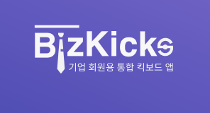

# 비즈킥스
## 법인 타겟 공유킥보드 중개 플랫폼 비즈니스
<br>
<br>


# 1. 👋팀 소개




- #### 팀 이름 : 킥스
- #### 팀장 : 김찬혁
- #### 팀원 : 박창환, 정혜일
- #### 역할 :

| 프론트 | 백엔드 | DevOps |  
|---|---|---|
| - 김찬혁 | - 정혜일 </br> - 박창환| -  정혜일 |

</br></br>

# 2. 📝개요
현재 퍼스널 모빌리티 산업은 성장하고 있습니다. 공유 킥보드의 월별 이용건수는 꾸준히 증가하고 있고 퍼스널 모빌리티 이용자 중 약 30% 가 출퇴근 목적으로 이용합니다.

현재 퍼스널모빌리티 시장은 개인 결제 중심이며 개인별 사용 시간량에 따른 과금 모델을 적용하고 있습니다. 이로인해 출퇴근시 퍼스널 모빌리티를 자주 이용하는 경우 교통비가 부담됩니다.
또 퍼스널 모빌리티 사업자는 법인 시장 진출에 필요한 자원이 부족합니다. 퍼스널 모빌리티 업체 규모상 법인 상대로 탐색 및 영업에 필요한 인력과 돈, 시간이 부족합니다.

이러한 문제점을 해결하기 위해 비즈킥스는 기업-킥보드 사업자 간 퍼스널 모빌리티 이용권 거래 중개 플랫폼 프로젝트를 진행하였습니다.

비즈킥스를 이용한다면
- 킥보드 사업자는 별도의 영업 활동없이 거래시스템에서 계약하여 법인 시장으로 확대 후 킥보드 가동수익을 높일 수 있게 됩니다.
- 기업은 복수의 퍼스널 모빌리티 사업자를 플랫폼에서 쉽게 탐색, 이용조건 설정 후 계약 가능합니다
-  기업 임직원은 기업이 계약한 모든 퍼스널 모빌리티를 복지 서비스로써 이용가능합니다.

<br>
<br>


# 2. 프로젝트 정보
##  프로젝트 환경
- java 8
- gradle 7.1.1
- springboot 2.5.3
- docker 20.10.7
- docker Compose v2.0.0-beta.6
- jenkins lts
- sonarQube lts
- mysql 5.6

<br>

## dependency
- spring boot devtools
- spring web
- lombok
- mysql
- json
- spring boot starter-data-jpa

<br>

## 실행방법
로컬 환경구성
```
cd dbenv
docker-compose up -d
```

local 에서 빌드 및 실행 시
```
gradlew build -x test
gradlew bootRun --args='--spring.profiles.active=local'
```
<br>

## 브랜치 정보
```
master
    - develop
        - alarmapi2
        - contractapi
```
<br>

## 디렉토리 정보
```
Bizkicks
 - backend
    - src
       - main
          - java\com\bizkicks\backend
             - api : controller가 들어있는 폴더
             - dto : DTO class가 들어있는 폴더
             - entity : Entity class가 들어있는 폴더
             - repository : Repository class가 들어있는 폴더
             - service : Service class가 들어있는 폴더
           - resource : config 파일과 resource 파일이 들어있는 폴더
       - test\java\com\bizkicks\backend : 테스트 코드들이 있는 폴더
 - dbend : 개발환경 설정을 위한 docker-compose.yml 파일 구성 폴더
```
<br>
<br>


# 3. 📋데이터베이스 스키마


<br>
<br>


# 4. 백엔드 API 명세서

[API 명세 링크](https://github.com/hyelie/SWM-Bizkicks-API-specification).
